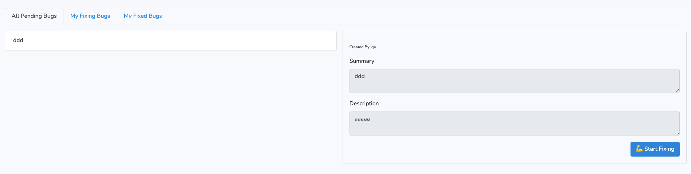
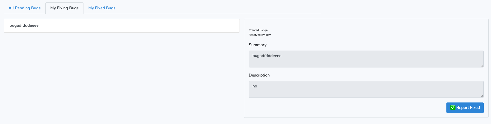
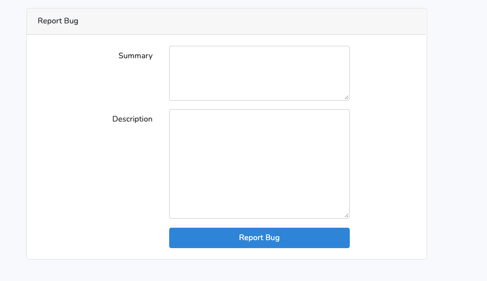
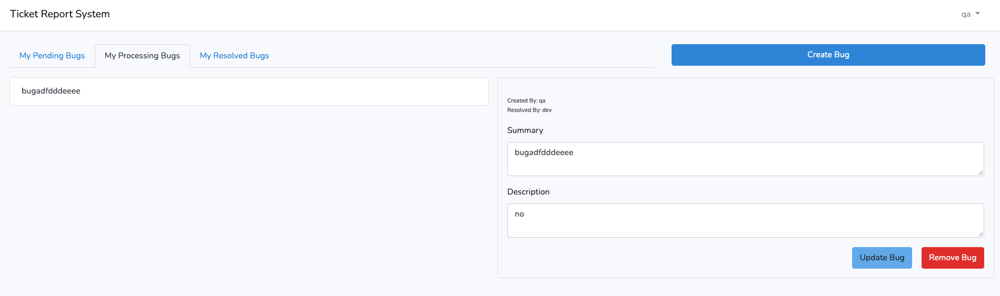
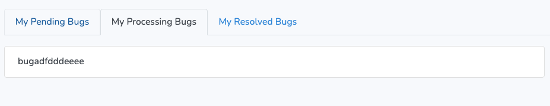
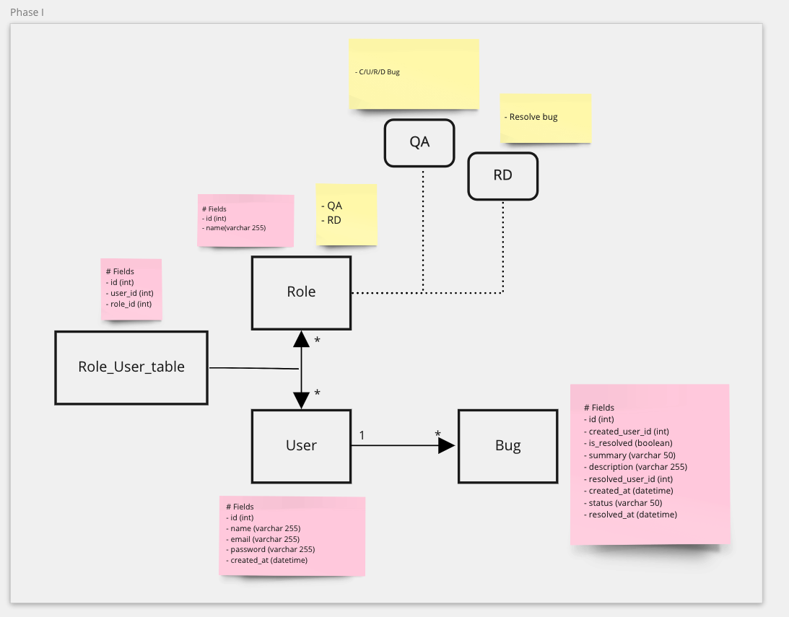
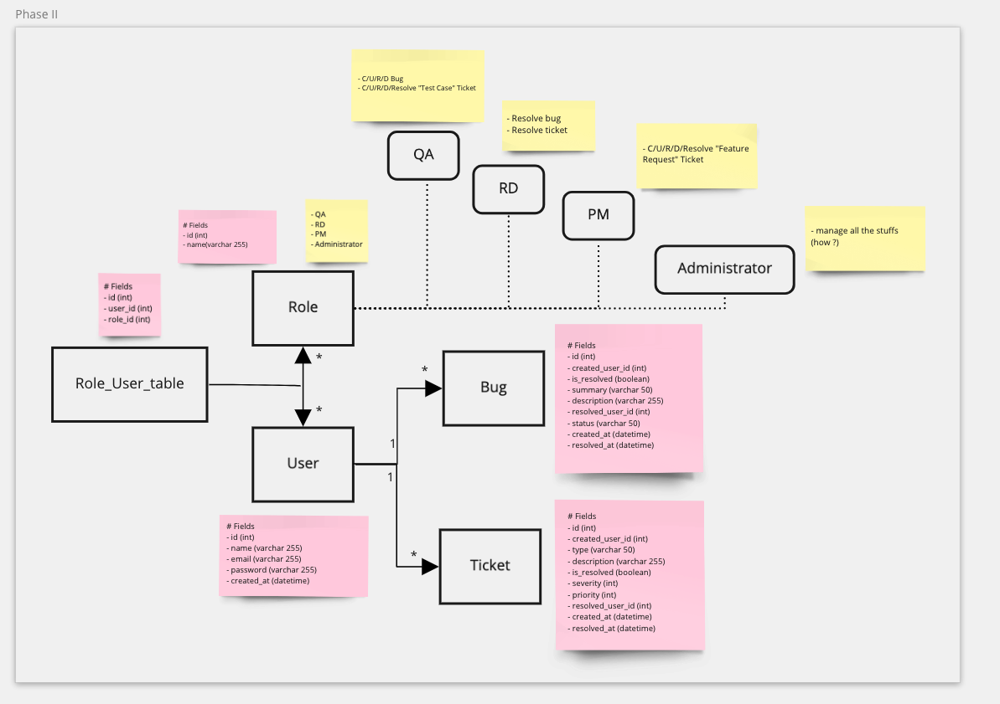
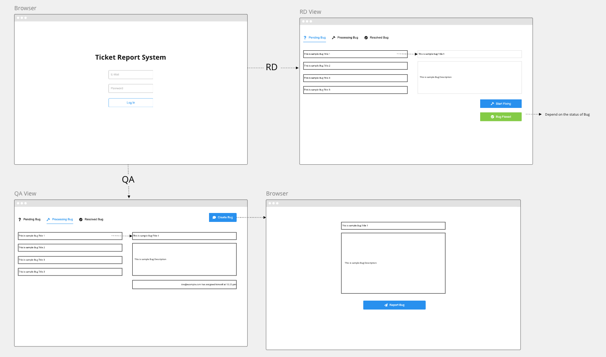

# Languages / Framework

- PHP / Laravel8
- Javascript / Vue
- Bootstrap5

# Task 1

### Phase 1

- RD / QA are able to login

- Developer could use command to create user

  ```bash
  php artisan user:create
  ```

- RD is able to:

    - Start Fixing bug

  

    - Resolve bug

      

- QA is able to:

    - create bug
    - modify the bug which he created
    - delete the bug  which he created

  

  

- RD / QA are able to see 3 statuses of bugs

  


### Phase 2

- RD / QA / PM / Administor are able to login
- RD is able to resolve bugs / tickets
- QA is able to CURD bugs / Test Case Tickets
- PM is able to CURD  Feature Request Tickets
- Administrator is able to manage all the stuffs (how ?)

---

# Task 3

data model, class diagram and UI mock up

## Phase1



## Phase 2




## Mockup




